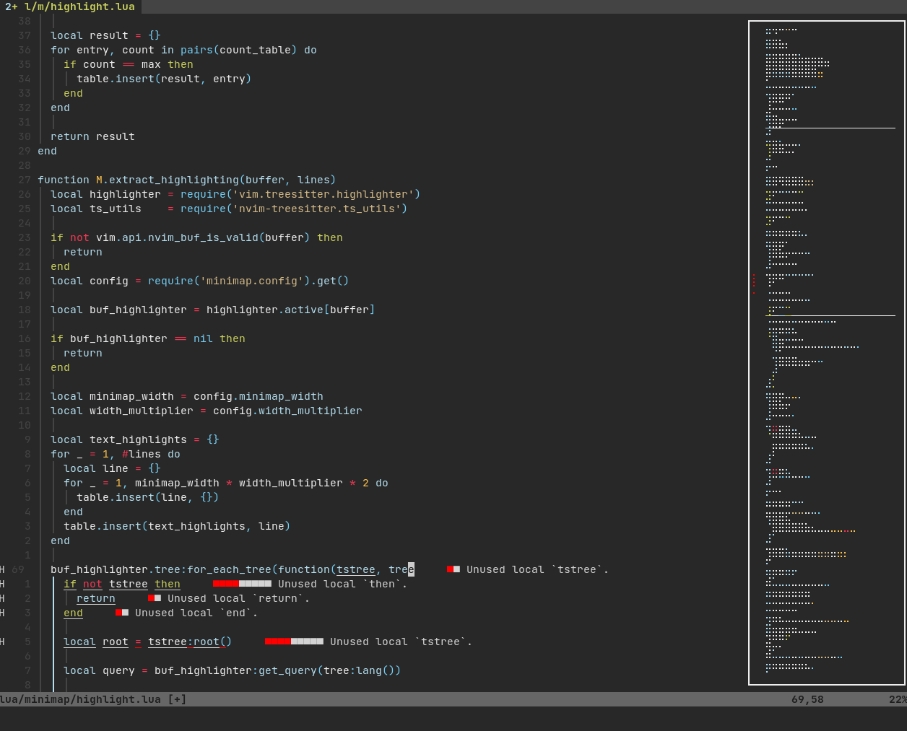

# Codewindow.nvim

Codewindow.nvim is a minimap plugin for neovim, that is closely integrated with treesitter and the builtin LSP to display more information to the user.



## How it works

Opening the minimap creates a floating window that will follow the active window around, always staying on the right, filling the entire height of said window. In this floating window.

In this floating window you can see the text rendered out using braille characters. Unless disabled, it will also try to get the treesitter highlights from the active buffer and apply them to the minimap[^1]. If the builtin LSP reports an error
or a warning, it will also appear as a small red or yellow dot next to the line the issue is in. The current viewport is shown as 2 white lines around the block of code being observed.

The minimap updates every time you leave insert mode, change the text in normal mode or the builtin LSP reports new diagnostics.

You can also focus the minimap, this lets you quickly move through the code to get to a specific point.

[^1] Because one character in the minimap represents several in the actual buffer, it will show the highlights that occured the most in that region.

## Installation

Packer:
```lua
use {
  'gorbit99/codewindow.nvim',
  config = function()
    local codewindow = require('codewindow')
    codewindow.setup()
    codewindow.apply_default_keybindings()
  end,
}
```

## Configuration

The setup method accepts an optional table as an argument with the following options (with the defaults):
```lua
{
  minimap_width = 20, --The width of the text part of the minimap
  width_multiplier = 4, --How many characters one dot represents
  use_lsp = true, -- Use the builtin LSP to show errors and warnings
  use_treesitter = true, -- Use nvim-treesitter to highlight the code
}
```

The default keybindings are as follows:
```
<leader>mm - open the minimap
<leader>mc - close the minimap
<leader>mf - focus/unfocus the minimap
```

To create your own keybindings, you can use the functions:
```lua
codewindow.open_minimap()
codewindow.close_minimap()
codewindow.toggle_focus()
```

## Performance

I tested the performance on the `lua/codewindow/highlight.lua` file in the repository, which was at the time of testing 181 lines long. Updating the minimap took 13ms on average.

## Related projects

- [https://github.com/wfxr/minimap.vim](https://github.com/wfxr/minimap.vim) - A very fast minimap plugin for neovim, though it relies on a separate program
- [https://github.com/echasnovski/mini.nvim](https://github.com/echasnovski/mini.nvim) - Funnily enough, this came out only a couple of days after I started working on codewindow

## TODO

- Toggle function - this is an oversight I'm too tired to fix right now, but shouldn't take long
- Help pages for the functions
- Faster updates - theoretically only the lines that were edited need updating
- Git support - I have a free column on the right reserved for it
- More display options - like floating to the left, not full height, etc. etc.
- Code cleanup - I'm putting this on the bottom, because I know I won't get to it
